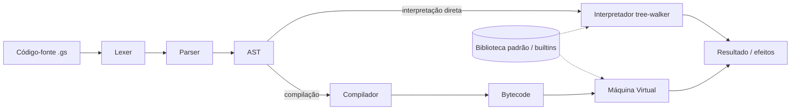
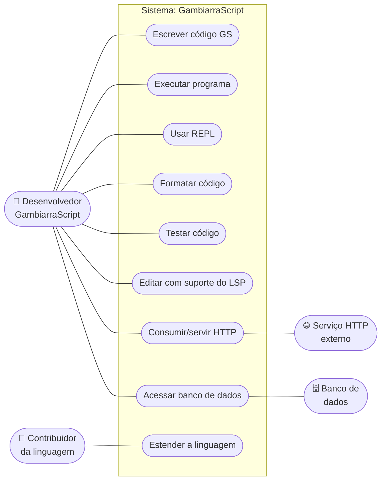
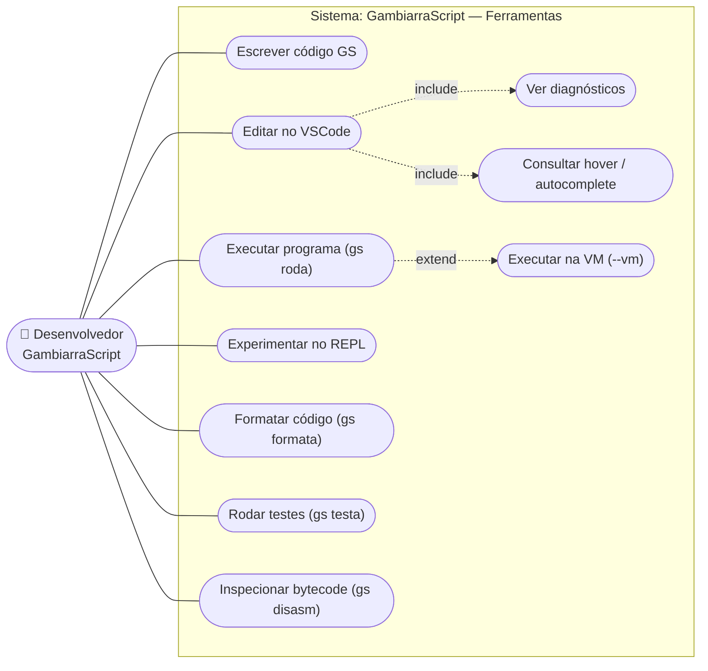
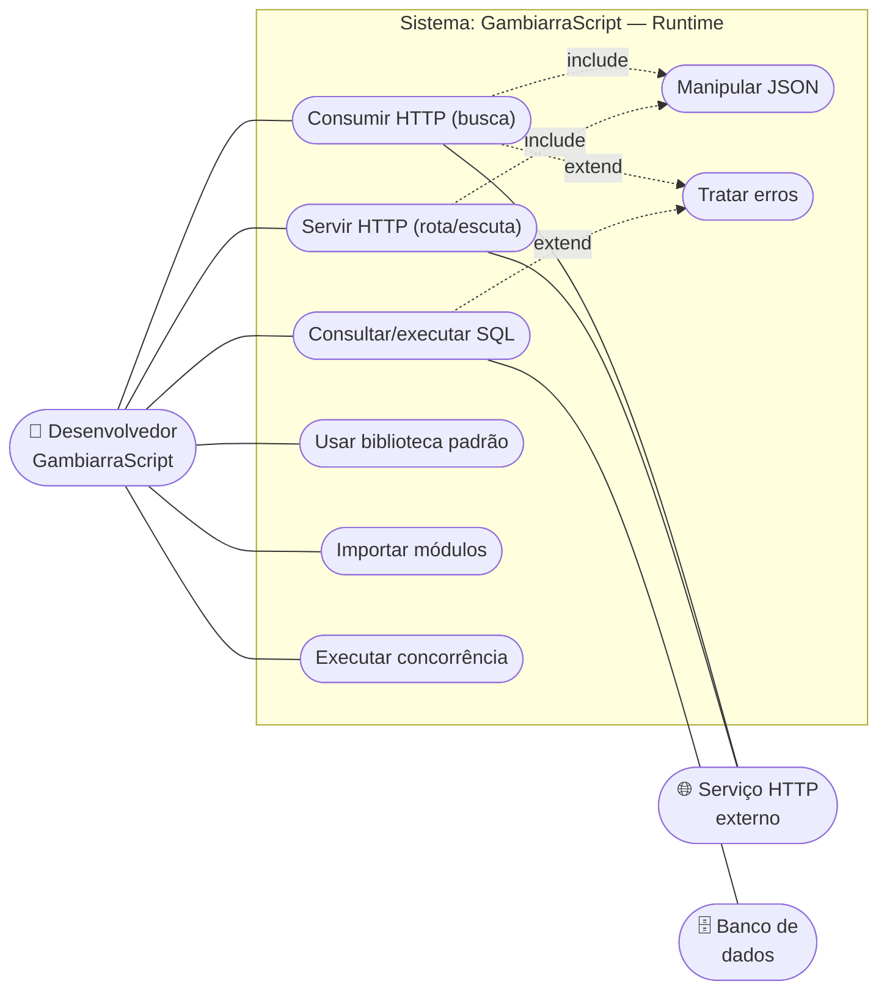

# Documento de Visão — GambiarraScript

| Campo | Valor |
|-------|-------|
| Produto | GambiarraScript (linguagem de programação e ecossistema de ferramentas) |
| Versão do documento | 1.0 |
| Data | 2026-07-01 |
| Repositório | `Desktop/projetos/gambiarrascript` |
| Status | Vigente |

---

## 1. Introdução

### 1.1 Propósito

Este documento descreve a **visão** do produto GambiarraScript: o problema que
ele resolve, para quem se destina, quais capacidades entrega e quais restrições
o delimitam. Ele serve como referência de alto nível para orientar decisões de
produto e de arquitetura, e como ponto de entrada para novos colaboradores.

Este documento **não** especifica detalhes de implementação, gramática formal da
linguagem ou API de builtins — esses temas ficam a cargo do código-fonte, dos
exemplos em `examples/` e do site de documentação em `web/`.

### 1.2 Escopo

O escopo cobre a linguagem GambiarraScript e o ecossistema de ferramentas que a
acompanha, todos escritos em Go e distribuídos no mesmo repositório:

- **Linguagem**: sintaxe com palavras-chave em português/gíria brasileira,
  tipagem dinâmica, funções de primeira classe, closures, tratamento de erros e
  concorrência.
- **Motores de execução**: interpretador *tree-walking* e máquina virtual (VM)
  baseada em bytecode, ambos com semântica equivalente.
- **Biblioteca padrão**: texto, listas, dicionários, matemática, JSON, cliente e
  servidor HTTP, banco de dados SQL, expressões regulares, tempo, criptografia,
  conjuntos, entrada/saída de arquivos e concorrência.
- **Ferramentas de desenvolvedor**: CLI (`gs`), REPL, formatador, servidor de
  linguagem (LSP), extensão para VSCode, *build* WebAssembly e site de
  documentação.

### 1.3 Definições, acrônimos e abreviações

| Termo | Significado |
|-------|-------------|
| GS | GambiarraScript |
| `gs` | Binário/CLI da linguagem |
| REPL | *Read–Eval–Print Loop*, console interativo |
| VM | Máquina virtual que executa bytecode compilado |
| Tree-walker | Interpretador que percorre diretamente a árvore sintática (AST) |
| AST | *Abstract Syntax Tree*, árvore sintática abstrata |
| LSP | *Language Server Protocol*, protocolo de servidor de linguagem |
| WASM | WebAssembly |
| Builtin | Função nativa disponível globalmente na linguagem |
| `.gs` | Extensão de arquivo de código-fonte GambiarraScript |

### 1.4 Referências

- `README.md` — visão geral e vocabulário da linguagem.
- `ROADMAP.md` — capacidades entregues e evolução planejada.
- `examples/` — programas de exemplo por domínio (HTTP, banco, JSON, libs, etc.).
- `web/` — site de documentação (Next.js).

---

## 2. Posicionamento

### 2.1 Contexto e oportunidade

Aprender programação normalmente esbarra em duas barreiras simultâneas: a
sintaxe abstrata (em inglês) e a curva de configuração do ambiente. Ao mesmo
tempo, linguagens temáticas e bem-humoradas têm forte apelo como ferramenta de
engajamento e divulgação. GambiarraScript ocupa esse espaço: é uma linguagem
completa, com palavras-chave em português e identidade cultural brasileira, que
torna conceitos de programação mais acessíveis e memoráveis sem abrir mão de um
runtime real e de ferramental profissional.

### 2.2 Declaração do problema

| Aspecto | Descrição |
|---------|-----------|
| O problema de | linguagens de brincadeira geralmente serem incompletas — sem biblioteca padrão, sem ferramentas e sem capacidade de escrever programas úteis de verdade. |
| Afeta | estudantes, criadores de conteúdo e entusiastas que querem uma linguagem acessível e divertida, mas funcional. |
| Cujo impacto é | ter que escolher entre uma linguagem *séria* (com curva de entrada maior) ou uma linguagem *de zoeira* (sem utilidade prática). |
| Uma boa solução seria | uma linguagem temática em português que, apesar da identidade descontraída, seja completa, tenha biblioteca padrão robusta e ferramental de desenvolvimento maduro. |

### 2.3 Declaração de posição do produto

| Aspecto | Descrição |
|---------|-----------|
| Para | desenvolvedores, estudantes e entusiastas de língua portuguesa |
| Que | querem uma linguagem acessível, divertida e ao mesmo tempo capaz de escrever programas reais |
| O GambiarraScript é | uma linguagem de programação de propósito geral, interpretada, com sintaxe em português |
| Que | oferece biblioteca padrão abrangente (HTTP, JSON, banco, regex, crypto, concorrência) e ferramental completo (CLI, REPL, formatador, LSP e extensão VSCode) |
| Diferentemente de | linguagens de brincadeira incompletas ou de linguagens tradicionais em inglês |
| O nosso produto | entrega um runtime real (com dois motores de execução) e experiência de desenvolvimento profissional, mantendo identidade cultural e humor. |

---

## 3. Stakeholders e usuários

### 3.1 Stakeholders

| Stakeholder | Interesse no produto |
|-------------|----------------------|
| Mantenedores do projeto | Evolução da linguagem, qualidade e coerência do ecossistema. |
| Contribuidores | Estender a linguagem, corrigir defeitos e adicionar builtins/ferramentas. |
| Educadores | Usar a linguagem como ferramenta didática de introdução à programação. |
| Comunidade | Adotar, divulgar e produzir conteúdo sobre a linguagem. |

### 3.2 Perfis de usuário

| Perfil | Descrição | Responsabilidades / uso |
|--------|-----------|-------------------------|
| **Desenvolvedor GambiarraScript** | Usuário principal. Escreve programas em `.gs`. | Escrever, formatar, executar, depurar e testar código; consumir a biblioteca padrão. |
| **Contribuidor da linguagem** | Desenvolvedor Go que trabalha no núcleo. | Estender lexer/parser/interpretador/VM, adicionar builtins, manter LSP e extensão. |
| **Educador / criador de conteúdo** | Usa a linguagem para ensinar ou divulgar. | Preparar exemplos, exercícios e material didático. |

### 3.3 Ambiente do usuário

- **Sistemas operacionais**: Linux, macOS e Windows (binário nativo por
  plataforma; no macOS pode ser necessário *codesign*).
- **Formas de execução**: binário nativo `gs` no PATH, execução via Docker (sem
  instalar Go) ou execução no navegador via *build* WebAssembly.
- **Editor recomendado**: VSCode com a extensão oficial (realce de sintaxe,
  *snippets*, execução por F5 e diagnósticos via LSP).

---

## 4. Necessidades e funcionalidades

| # | Necessidade | Funcionalidade que atende | Prioridade |
|---|-------------|---------------------------|------------|
| N1 | Escrever programas com sintaxe acessível em português | Linguagem com palavras-chave em português/gíria BR | Alta |
| N2 | Executar programas de forma simples | CLI `gs roda`, com motores tree-walker e VM (`--vm`) | Alta |
| N3 | Experimentar código interativamente | REPL com avaliação imediata (`=> valor`) | Média |
| N4 | Manter o código legível e padronizado | Formatador (`gs formata`) | Média |
| N5 | Ter feedback de erros enquanto edita | LSP com diagnósticos, *hover* e autocomplete + extensão VSCode | Alta |
| N6 | Escrever programas úteis de verdade | Biblioteca padrão abrangente (texto, listas, math, JSON, HTTP, banco, regex, tempo, crypto, set, arquivos) | Alta |
| N7 | Integrar com serviços externos | Cliente HTTP (`busca`) e servidor HTTP (`rota`/`escuta`) | Alta |
| N8 | Persistir e consultar dados | Acesso a banco SQL (`conecta`/`consulta`/`executa`) | Média |
| N9 | Organizar código em partes reutilizáveis | Módulos via `importa` (tree-walker e VM) | Média |
| N10 | Lidar com falhas de forma controlada | Tratamento de erros (`arruma`/`quebrou`) com rastro de pilha | Alta |
| N11 | Executar tarefas concorrentes | Concorrência (`bora`, `paralelo`, canais) | Média |
| N12 | Rodar sem instalar dependências | Execução via Docker e *build* WebAssembly | Média |

---

## 5. Visão geral do produto

### 5.1 Perspectiva do produto

GambiarraScript é um sistema autocontido, sem dependência de serviços externos
para funcionar. O código-fonte `.gs` passa por um *pipeline* de compilação
front-end (lexer → parser → AST) e é executado por um de dois motores:

Em torno desse núcleo existe o ferramental de desenvolvedor (CLI, REPL,
formatador, LSP, extensão VSCode, *build* WASM e site de documentação), que
compartilha os mesmos componentes de front-end da linguagem.

### 5.2 Suposições e dependências

- A construção do produto depende do **toolchain Go** (compilação nativa ou via
  Docker).
- O acesso a **banco de dados** depende de drivers SQL (SQLite, MySQL/MariaDB,
  PostgreSQL); o *build* WebAssembly exclui esses drivers.
- Os recursos de **HTTP** e **banco** dependem de serviços externos disponíveis
  em tempo de execução.
- A experiência de edição plena depende do **VSCode** com a extensão oficial.

### 5.3 Instalação e distribuição

- Compilação e instalação do binário nativo `gs` no PATH (com opção `--user`).
- Execução sem instalação via Docker (helper `scripts/dgo`).
- Execução no navegador via *build* WebAssembly.

---

## 6. Funcionalidades do produto

Capacidades de alto nível oferecidas pelo produto:

- **F1 — Linguagem de propósito geral**: variáveis, condicionais, laços,
  funções, closures, escopo, operadores lógicos com booleano normalizado.
- **F2 — Dois motores de execução equivalentes**: interpretador tree-walker e
  VM de bytecode (`gs roda --vm`).
- **F3 — Biblioteca padrão abrangente**: texto, listas, dicionários,
  matemática, conjuntos, JSON, regex, tempo, criptografia e I/O de arquivos.
- **F4 — Integração com a web**: cliente HTTP (`busca`) e servidor HTTP
  (`rota`/`escuta`) para escrever APIs REST completas.
- **F5 — Persistência**: acesso a bancos SQL com *placeholders* por driver.
- **F6 — Modularização**: importação de arquivos `.gs` via `importa`.
- **F7 — Tratamento de erros**: `arruma`/`quebrou` com objeto de erro rico
  (mensagem, linha, tipo, pilha, causa).
- **F8 — Concorrência**: execução paralela (`bora`, `paralelo`) e canais.
- **F9 — Ferramental de desenvolvimento**: CLI, REPL, formatador, LSP (com
  diagnósticos, *hover* e autocomplete) e extensão VSCode.
- **F10 — Portabilidade**: binários multiplataforma, execução via Docker e
  *build* WebAssembly.

---

## 7. Casos de uso

Esta seção apresenta os atores do sistema, os diagramas de casos de uso e a
especificação resumida dos casos de uso principais.

### 7.1 Atores

| Ator | Tipo | Descrição |
|------|------|-----------|
| **Desenvolvedor GambiarraScript** | Primário | Escreve e executa programas `.gs`, usa REPL, formatador e editor. |
| **Contribuidor da linguagem** | Primário | Estende o núcleo (linguagem, builtins, ferramentas). |
| **Serviço HTTP externo** | Secundário | Sistema remoto consumido (`busca`) ou cliente que consome um servidor GS. |
| **Banco de dados** | Secundário | Sistema SGBD SQL acessado pelos programas GS. |

### 7.2 Diagrama geral de casos de uso

### 7.3 Diagrama — Desenvolvimento e ferramentas

Casos de uso relacionados ao ciclo de escrever, executar e manter código.

> As relações `include` indicam que editar no VSCode sempre aciona diagnósticos
> e *hover*/autocomplete via LSP; a relação `extend` indica que executar na VM é
> uma variação opcional da execução padrão.

### 7.4 Diagrama — Capacidades de runtime

Casos de uso disponíveis para o programa GS em tempo de execução.

> `Manipular JSON` é tipicamente incluído no consumo/serviço de HTTP (parsear o
> corpo do pedido e serializar a resposta); `Tratar erros` estende operações de
> I/O que podem falhar (rede, banco).

### 7.5 Especificação resumida dos casos de uso principais

#### UC01 — Executar programa

| Campo | Descrição |
|-------|-----------|
| Ator principal | Desenvolvedor GambiarraScript |
| Pré-condições | Existe um arquivo `.gs` válido; `gs` disponível (nativo ou Docker). |
| Fluxo principal | 1. O desenvolvedor invoca `gs roda arquivo.gs`. 2. O sistema faz lexing e parsing do código. 3. O interpretador tree-walker avalia a AST. 4. O sistema produz a saída/efeitos do programa. |
| Fluxos alternativos | **A1 (VM):** com `--vm`, o código é compilado para bytecode e executado pela VM, com resultado equivalente. |
| Fluxos de exceção | **E1:** erro de sintaxe/execução → o sistema reporta a mensagem com a linha. |
| Pós-condições | O programa é executado e seus efeitos (saída, arquivos, requisições) são aplicados. |

#### UC02 — Experimentar no REPL

| Campo | Descrição |
|-------|-----------|
| Ator principal | Desenvolvedor GambiarraScript |
| Pré-condições | `gs` disponível. |
| Fluxo principal | 1. O desenvolvedor abre o REPL (`gs repl`). 2. Digita uma expressão/instrução. 3. O sistema avalia e exibe o resultado (`=> valor`). 4. Repete até encerrar a sessão. |
| Pós-condições | O estado da sessão (variáveis, funções) persiste enquanto o REPL estiver aberto. |

#### UC03 — Editar com suporte do LSP

| Campo | Descrição |
|-------|-----------|
| Ator principal | Desenvolvedor GambiarraScript |
| Pré-condições | VSCode com a extensão oficial instalada. |
| Fluxo principal | 1. O desenvolvedor edita um arquivo `.gs`. 2. O LSP analisa o código e publica diagnósticos. 3. O editor exibe realce de sintaxe, erros sublinhados, *hover* e autocomplete. 4. O desenvolvedor pode executar com F5. |
| Fluxos de exceção | **E1:** identificador não resolvível → aviso do *typechecker* básico. |
| Pós-condições | O código é editado com feedback contínuo de qualidade. |

#### UC04 — Consumir/servir HTTP

| Campo | Descrição |
|-------|-----------|
| Ator principal | Desenvolvedor GambiarraScript |
| Atores secundários | Serviço HTTP externo |
| Pré-condições | Conectividade de rede disponível. |
| Fluxo principal (consumo) | 1. O programa chama `busca(url)`. 2. O sistema faz a requisição HTTP. 3. Retorna um dicionário `{status, ok, corpo, cabecalhos}`. |
| Fluxo principal (serviço) | 1. O programa registra rotas com `rota(metodo, caminho, handler)`. 2. Chama `escuta(porta)`. 3. O sistema atende requisições, invocando o *handler* correspondente. |
| Inclui | Manipular JSON (`de_json`/`pra_json`) para corpo de requisição/resposta. |
| Fluxos de exceção | **E1:** falha de rede/timeout → erro tratável via `arruma`/`quebrou`. |
| Pós-condições | Requisição consumida ou servidor no ar atendendo requisições. |

#### UC05 — Acessar banco de dados

| Campo | Descrição |
|-------|-----------|
| Ator principal | Desenvolvedor GambiarraScript |
| Atores secundários | Banco de dados |
| Pré-condições | SGBD acessível; driver suportado (SQLite, MySQL/MariaDB, PostgreSQL). |
| Fluxo principal | 1. O programa chama `conecta(dsn)`. 2. Executa `consulta`/`executa` com *placeholders*. 3. Recebe as linhas (consulta) ou o número de linhas afetadas (execução). 4. Chama `fecha(conn)`. |
| Fluxos de exceção | **E1:** erro de conexão/SQL → erro tratável via `arruma`/`quebrou`. |
| Pós-condições | Dados consultados ou alterados; conexão encerrada. |

#### UC06 — Estender a linguagem

| Campo | Descrição |
|-------|-----------|
| Ator principal | Contribuidor da linguagem |
| Pré-condições | Ambiente Go configurado (nativo ou Docker). |
| Fluxo principal | 1. O contribuidor altera o núcleo (lexer/parser/interpretador/VM/builtins). 2. Sincroniza pontos correlatos (LSP, extensão VSCode, exemplos). 3. Roda a suíte de testes (`./scripts/dgo test ./...`). 4. Valida que tree-walker e VM permanecem equivalentes. |
| Pós-condições | Nova capacidade disponível de forma consistente em todo o ecossistema. |

---

## 8. Restrições

| # | Restrição |
|---|-----------|
| R1 | O núcleo é implementado em Go; a construção depende do toolchain Go. |
| R2 | O *build* WebAssembly não inclui drivers de banco de dados. |
| R3 | O servidor HTTP atende requisições de forma serializada por padrão (concorrência real é opt-in/evolutiva). |
| R4 | A biblioteca padrão e as palavras-chave usam português; a eventual migração/aliasing para inglês está sob avaliação (ver ROADMAP). |
| R5 | No macOS, o binário nativo pode exigir *codesign* para execução. |

---

## 9. Requisitos não-funcionais / atributos de qualidade

| Atributo | Descrição |
|----------|-----------|
| **Usabilidade** | Sintaxe acessível em português; mensagens de erro com linha; feedback em tempo de edição via LSP. |
| **Portabilidade** | Binários multiplataforma, execução via Docker e no navegador (WASM). |
| **Consistência** | Semântica equivalente entre o interpretador tree-walker e a VM. |
| **Manutenibilidade** | Código organizado em pacotes por responsabilidade (lexer, parser, ast, interpreter, compiler, vm, lsp, etc.); suíte de testes automatizados. |
| **Confiabilidade** | Tratamento de erros com objeto rico (mensagem, tipo, linha, pilha, causa). |
| **Instalabilidade** | Instalação simples no PATH ou uso sem instalação via Docker. |

---

## 10. Fora de escopo e evolução futura

Itens reconhecidamente **fora do escopo atual**, previstos como evolução (ver
`ROADMAP.md`):

- Depuração com *breakpoints* (DAP) e `gs debug`.
- *Profiler* / `gs bench`.
- Gerenciador de pacotes e módulos versionados (`gs get`, `gambiarra.json`).
- Interpolação de *strings*, `printf` e utilidades de sistema de arquivos completas.
- Operadores *bitwise*, `async`/`await` sintático, *generics*, *lambdas*
  anônimas, *destructuring* e `match`/`switch`.
- FFI/integração com Go, `struct`/records definidos pelo usuário.
- Cache de bytecode (`.gsc`) e `gs build` de binário standalone.
- Decisão sobre migração das palavras-chave para o inglês mantendo o tema.

---

*Documento de Visão do GambiarraScript — feito na gambiarra, com carinho. 🛠️*
